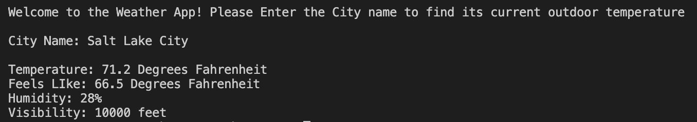

# This is a weather App
## Description:
This program is a simple porgram that outputs the weater in a selected city. Simply type in the name of the city and you will receive the current weather as the output. If the city can not be found, the program will return an error statement.
## Installation/Execution:
To Execute this program, fist you need to download the weather.py file. Next you're going to have to install pip to make sure you have the requests library. Pip comes default with python after version 3.2. If you're using a later version of python you will have to install it. [This website](https://www.pythonforbeginners.com/requests/using-requests-in-python) has a great way of explaining the process. After pip is installed use the command `pip install requests` in your terminal to install the required library requests. After this you must either ask me for my api url and id or sign up for your own [here](https://openweathermap.org/current). After you have received an api id and url, you can simply put those into the variables url and id or create a file named "password.py" to hold those variables. When you've completed all of these tasks you can run the program in your terminal/command program with the command `python` followed by the location of the file.
## Photos:

## Useful Websites:
* [Install Pip](https://www.pythonforbeginners.com/requests/using-requests-in-python)
* [Use pip to isntall Requests Library](https://www.pythonforbeginners.com/requests/using-requests-in-python)
* [Weather API Info](https://openweathermap.org/current)
* [Using JSON with Python](https://www.w3schools.com/python/python_json.asp)
* [Working With Loobs in Python](https://www.w3schools.com/python/python_for_loops.asp)
* [Python Module](https://byui-cse.github.io/cse310-course/modules/language_python/module_language_python.html)
## Principles Used
* Variables
* Expressions
* Conditionals
* Loops
* Functions